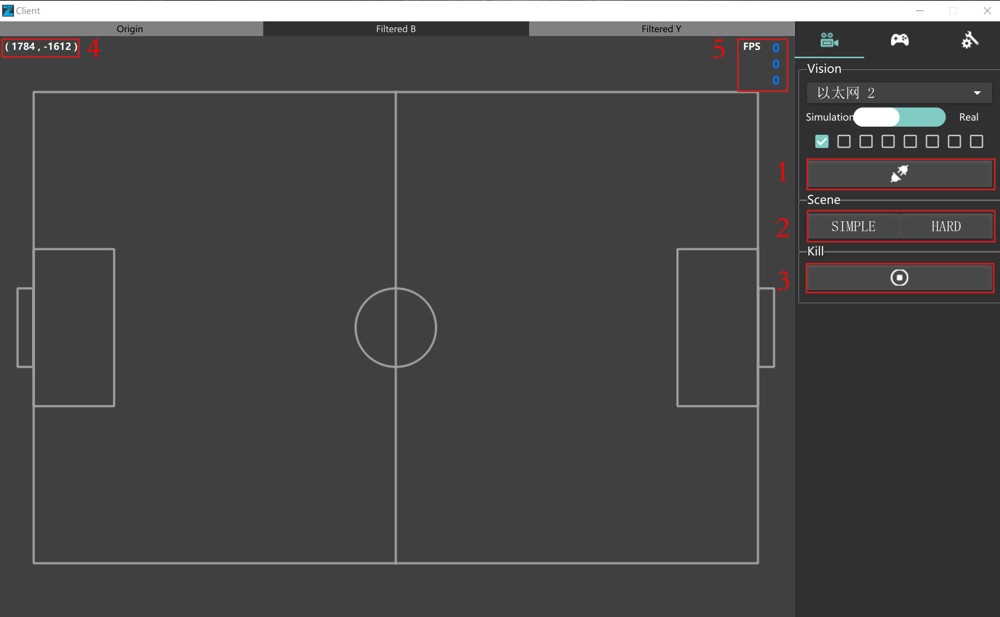

# Client使用说明

## TOC

1. [软件基本使用](#软件基本使用)
2. [控制流程](#控制流程)
3. [如何实现收发包](#如何实现收发包)
4. [如何绘制Debug信息](#如何绘制Debug信息)

## 软件基本使用



- 红色方框1的按钮可以选择连接或者断开图像
- 红色方框2的按钮选择测试的场景，分为simple和hard
- 红色方框3的按钮可以快速关闭程序
- 红色方框4显示的是鼠标所指位置的坐标，单位mm
- 红色方框5分别显示图像帧数、蓝车控制指令帧数、黄车控制指令帧数
- 常用小技巧：连接图像后，使用``、1-10、-、+、i、o、p、[`可以控制蓝车数量从0-16变化，如果同时按住`ctrl`可以控制黄车数量；鼠标可以直接拖动机器人


- 点击红色方框1的按钮可以切换到log的工具栏
- 红色方框2的按钮可以开始或者停止录制log，默认开启
- 红色方框内显示log播放信息，最左边文件夹按钮可以打开log文件进行播放（打开时需要断开图像连接），其他按钮分别是开始、停止、快退、快进

## 控制流程


**基本流程**

自己的程序接收来自Client的图像信息（场上机器人的位置、速度等），进行路径、速度规划之后发送小车控制指令给Client。

这个过程中，信息的传递是通过protobuf实现的。形象地说，UDP是交流的方式，Protobuf是语言。

**Protobuf**

protobuf(Protocal Buffers)是google开发的一种用于序列化结构化数据（JSON、XML)的一种方式。它灵活、高效，只需要关于数据结构的描述.proto，就可以使用compiler自动生成进行编码、解析的class，这个class提供了getter和setter这些method读写protobuf。

[参考链接](https://developers.google.com/protocol-buffers/docs/cpptutorial)

## 如何实现收发包

### 接收图像信息（vision_detection.proto）

**Vision_DetectionFrame——多个机器人的图像信息包**

```protobuf
message Vision_DetectionFrame {
  required Vision_DetectionBall  balls         = 1;
  repeated Vision_DetectionRobot robots_yellow = 2;
  repeated Vision_DetectionRobot robots_blue   = 3;
}
```

Vision_DetectionFrame相当于多个机器人的图像信息封在一起

球的信息可以不管

**Vision_DetectionRobot——单个机器人的图像信息包**

```protobuf
message Vision_DetectionRobot {
  required bool   valid    =  1;
  optional uint32 robot_id      =  2;
  required float  x             =  3;
  required float  y             =  4;
  optional float  orientation   =  5;
  optional float  vel_x         =  6;
  optional float  vel_y         =  7; 
}
```

Vision_DetectionRobot可以获取机器人的id、位置、朝向、速度。

**Example——读取蓝车的ID位置速度**

c++:

```c++
// Parse from datagram
Vision_DetectionFrame vision;
vision.ParseFromArray(datagram, datagram.size());

// Read blue robot info
int blue_size = vision.robots_blue_size();
for (int i=0; i<blue_size; i++){
    int robot_id = vision.robots_blue(i).robot_id();
    MyDataManager::instance()->blueRobots[robot_id].robot_id = robot_id;
    MyDataManager::instance()->blueRobots[robot_id].x = vision.robots_blue(i).x()/10;
    MyDataManager::instance()->blueRobots[robot_id].y = -vision.robots_blue(i).y()/10;
    MyDataManager::instance()->blueRobots[robot_id].vel_x = vision.robots_blue(i).vel_x();
    MyDataManager::instance()->blueRobots[robot_id].vel_y = vision.robots_blue(i).vel_y();
}
```

python:

```python
vision_frame = Vision_DetectionFrame()
data, server = sock.recvfrom(4096)
vision_frame.ParseFromString(data)
for robot_blue in vision_frame.robots_blue:
    print('Robot Blue {} pos: {} {}'.format(robot_blue.robot_id, robot_blue.x, robot_blue.y))
for robot_yellow in vision_frame.robots_yellow:
    print('Robot Yellow {} pos: {} {}'.format(robot_yellow.robot_id, robot_yellow.x, robot_yellow.y))
```

### 发送控制指令（zss_cmd.proto）

**Robots_Command——多个机器人的控制指令包**

```protobuf
message Robots_Command {  
  repeated Robot_Command command = 1;   
  // delay * 0.1ms  
  optional int32 delay = 2;  
}
```

Robot_Command相当于多个机器人的command封在一起

Optional delay是可选的，可以不管

**Robot_Command——单个机器人的控制指令包**

```protobuf
message Robot_Command {  
  // The unique ID of the robot, as identified by SSL-Vision.  
  required int32 robot_id = 1;
  // Desired forward drive velocity in cm/s .  
  required float velocity_x = 2;
  // Desired sideways left drive velocity in cm/s .  
  required float velocity_y = 3;  
  // Desired counterclockwise angular velocity in 1/40 radians / second.  
  required float velocity_r = 4;   
}  
```

需要控制的分别是机器人的ID、vx、vy、w的速度，只需要控制这些变量即可完成路径规划工作

**Example——控制0号小车以10cm/s的速度向前运动**

C++：

```c++
Robots_Command commands;  
Robot_Command* command = commands.add_command();  
command->set_robot_id(0);  
command->set_velocity_x(10);  
command->set_velocity_y(0);  
command->set_velocity_r(0);  
command->set_kick(true);  
command->set_power(0);  
command->set_dribbler_spin(0);    
```

Python:

```python
commands = Robots_Command()
command = commands.command.add()
command.robot_id = 0
command.velocity_x = 10
command.velocity_y = 0
command.velocity_r = 0
command.kick = False
command.power = 0
command.dribbler_spin = False
self.sock.sendto(commands.SerializeToString(), self.command_address)
```

## 如何绘制Debug信息

### Debug信息（zss_debug.proto）

**Debug_Msgs——多个Debug信息包合在一起**

```protobuf
message Debug_Msgs{  
    repeated Debug_Msg msgs= 1;  
} 
```

**Debug_Msg——单个Debug信息包**

1. 选择Debug信息类型

   ```protobuf
   enum Debug_Type {  
       ARC   = 0;  
       LINE  = 1;          
       TEXT  = 2;  
       ROBOT = 3;  
       CURVE = 4;  
       POLYGON = 5;  
       Points   = 6;  
   }  
   ```

2. 选择Debug信息颜色

   ```protobu
   enum Color {  
       WHITE =     0;  
       RED =       1;  
       ORANGE =    2;  
       YELLOW =    3;  
       GREEN =     4;  
       CYAN =      5;  
       BLUE =      6;  
       PURPLE =    7;  
       GRAY =      8;  
       BLACK =     9;  
   }  
   ```

3. 填写对应的Debug信息

   ```protobu
   optional Debug_Arc arc =    3;  
   optional Debug_Line line =  4;  
   optional Debug_Text text =  5;  
   optional Debug_Robot robot= 6;  
   optional Debug_Curve_ curve = 7;  
   optional Debug_Polygon polygon = 8;  
   optional Debug_Points points = 9;
   ```

CURVE和POLYGON现在用不了

用Points和Line其实就足够了

**Example——绘制一个圆**


c++：

```c++
Debug_Msgs msgs;  
Debug_Msg* msg = msgs.add_msgs();  
msg->set_type(Debug_Msg_Debug_Type_ARC);  
msg->set_color(Debug_Msg_Color_RED);  
Debug_Arc* arc = msg->mutable_arc();  
Rectangle* rec = arc->mutable_rectangle();  
Point* p1 = rec->mutable_point1();  
Point* p2 = rec->mutable_point2();  
p1->set_x(x/10-30);  
p1->set_y(y/10-30);  
p2->set_x(x/10+30);  
p2->set_y(y/10+30);  
arc->set_start(0);  
arc->set_end(360);  
arc->set_fill(true);  
```

python:

```python
package = Debug_Msgs()
msg = package.msgs.add()
msg.type = Debug_Msg.ARC
msg.color = Debug_Msg.WHITE
arc = msg.arc
pos = (-1000, 500)
radius = 300
arc.rectangle.point1.x = pos[0] - radius
arc.rectangle.point1.y = pos[1] - radius
arc.rectangle.point2.x = pos[0] + radius
arc.rectangle.point2.y = pos[1] + radius
arc.start = 0
arc.end = 360
arc.FILL = True
self.sock.sendto(package.SerializeToString(), self.debug_address)
```

